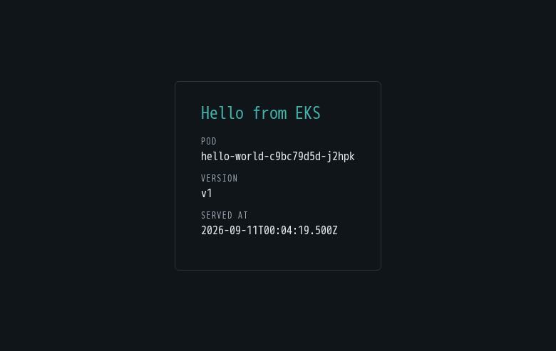

# tech-challenge

A modern EKS platform on AWS, built entirely in code — including the domain
registration. Deployed and verified end to end, and written to be read by
engineers learning how the pieces fit together.



*The demo above ran at `https://hello.elbeetest.com`. The stack is torn down
between sessions — `make up ENV=dev` rebuilds it, and the URL depends on the
domain you supply.*

---

## What this is

This repository began as a 2022 tech challenge: two VPCs joined by a Transit
Gateway, an SSH bastion, a Jenkins pipeline, and a self-managed Elasticsearch
stack. It has been reviewed line by line and rebuilt.

It serves two purposes at once — a demonstration of end-to-end infrastructure
automation, and teaching material for engineers who have not built this before.
The original code is preserved on the `master` branch and, where a pattern is
still worth understanding, under [`optional/`](optional/) with a written
post-mortem.

The guiding constraint: **no ClickOps.** The only manual step is obtaining AWS
credentials. Everything else — the state bucket, the cluster, the certificate,
the DNS records, the domain registration itself — is Terraform.

## Architecture

Single VPC across three availability zones. Nodes have no public IP and no
inbound path. An internet-facing ALB in the public subnets registers **pod IPs**
as targets, so the load balancer crosses the public/private boundary and the pods
never do.

```
Internet ──HTTPS──▶ ALB (public subnets)
                     │  target-type: ip
                     ▼
                    Pods (private subnets, no public IP)
                     │
                     └──▶ NAT ──▶ IGW ──▶ Internet   (egress only)

Engineer ──SSM port-forward──▶ SSM host ──▶ EKS API   (no SSH, no open ports)
```

Editable diagram: [`docs/architecture.drawio`](docs/architecture.drawio) — open
at [diagrams.net](https://app.diagrams.net).

| Layer | Choice |
|---|---|
| Network | One VPC, 3 AZs, private `/19`s for pods, public `/24`s for load balancers |
| Cluster | EKS 1.35, AL2023 nodes, private endpoint + narrow public allowlist |
| Authorization | `authentication_mode = "API"` with access entries — no `aws-auth` |
| Workload IAM | EKS Pod Identity |
| Ingress | AWS Load Balancer Controller, ALB, ACM, ExternalDNS |
| Observability | Fluent Bit + Container Insights to CloudWatch |
| CI/CD | GitHub Actions with OIDC — no long-lived AWS credentials |
| State | S3 with native conditional-write locking, per environment |

## Quick start

```bash
aws sso login --profile <your-profile>
export AWS_PROFILE=<your-profile>

make preflight ENV=dev         # shows every value it derived; change nothing
make bootstrap ENV=dev         # once per account: state bucket + CI identity
make ci-secrets                # push the CI role ARNs to GitHub (optional)
make up        ENV=dev         # backend, infra, cluster software, app — one command
```

`make up` calls `make bootstrap` implicitly if the state bucket is missing, so
the explicit call is only needed when you want the CI role ARNs printed.

**No file edits are required to deploy into a different AWS account.** Everything
account-specific is derived rather than configured:

| Value | Derived from |
|---|---|
| Account id | `aws sts get-caller-identity` |
| State bucket | `<project>-tfstate-<account-id>`, created if it does not exist |
| Backend config | generated into `.backend/` at init time, never committed |
| GitHub repository | `git remote get-url origin`, so a fork never trusts the upstream repo |
| Region, project | `environments/<env>.tfvars` |
| Cluster name | `<project>-<env>-cluster` |
| ECR registry | injected at deploy time; the manifests in git carry no account id |

`make up` runs each stage only after the previous one is genuinely ready — it
waits for the cluster to report `ACTIVE`, for nodes to become `Ready`, and for
the load balancer controller's webhook to serve, because none of those are true
merely because the preceding `apply` returned zero. It shows the plan and asks
before applying; pass `CONFIRM=1` for unattended runs.

`make down ENV=dev` tears everything down in the order that works — and
deliberately does **not** touch `bootstrap/`. The state bucket and the CI
identity live there precisely so a routine teardown cannot remove them: CI has
to survive in order to rebuild what it just destroyed. `make help`
lists every target. Full procedures are in the
[consumption guide](docs/consumption-guide.docx).

## Documentation

| Document | What it covers |
|---|---|
| [Consumption guide](docs/consumption-guide.docx) (DOCX) | Deploy, verify, operate, tear down, troubleshoot |
| [Architecture review](docs/architecture-review.html) | The original code review and target design |
| [Architecture diagram](docs/architecture.drawio) | Editable draw.io source |
| [Walkthrough](docs/walkthrough.md) | Teaching narrative — what broke and what it taught |
| [ADRs](docs/adr/) | Seven decision records, with the options rejected |
| [Observability](docs/observability.md) | Log groups, working queries, the nested-JSON trap |

## Repository layout

```
.                      infrastructure root module (VPC, EKS, IAM, DNS, ECR)
cluster-addons/        second root: LB controller, ExternalDNS, StorageClass
bootstrap/             state backend + GitHub OIDC CI identity; outlives any environment
modules/               hand-written modules: ecr, iam/role
environments/          per-environment tfvars and backend config
app/                   the demo application and its Kustomize manifests
.github/workflows/     plan on PR, apply on merge, build and deploy
docs/                  guides, ADRs, diagram, screenshots
optional/              superseded patterns, kept with post-mortems
```

### Why two root modules

The `kubernetes` and `helm` providers authenticate against the cluster API, so
`terraform plan` has to *reach* it even to compute a diff. The endpoint is
CIDR-restricted, and a GitHub-hosted runner is not on that list. Splitting
cluster software into `cluster-addons/` lets the infrastructure root plan from
anywhere. It also fixes an older problem: a destroy that removes the cluster
while Terraform still needs to authenticate to it in order to delete Helm
releases.

## What changed, and why

| Removed | Replaced by | Reason |
|---|---|---|
| Second VPC + Transit Gateway | Subnet routing in one VPC | Isolation comes from routing, not a VPC boundary. Saved a hop and ~$73/mo |
| `routes.sh` in a `null_resource` | Nothing | Shelling out puts a resource outside plan, drift detection and teardown |
| Two SSH bastions, shared key pair | One SSM host | No key, no public IP, no inbound rules, CloudTrail-audited |
| Internal Classic Load Balancer | ALB with `target-type: ip` | Public app, private pods, TLS as an annotation |
| `aws-auth` ConfigMap | EKS access entries | Adding an operator stops being a manual edit to a live cluster |
| Self-managed EFK | CloudWatch observability addon | The old PVC could never have bound on a modern cluster |
| Jenkins with static keys | GitHub Actions with OIDC | No long-lived credentials; gates that can actually fail |
| `sed -i` on tracked manifests | Kustomize, deploy by digest | Idempotent, and new builds actually roll out |

Full reasoning, including the options rejected, is in the
[ADRs](docs/adr/).

## Two findings worth knowing

**The "private" cluster was not private.** `vpc_config` set only `subnet_ids`,
so AWS applied its defaults: public endpoint, `0.0.0.0/0`, private access
disabled. An unset field is a decision made by someone who has never seen your
architecture.

**None of the pipeline's security gates could fail.** Sonar ran with
`abortPipeline: false`, and neither Trivy call passed an exit code — using a
flag renamed years earlier, so it probably was not running at all. When the
replacement pipeline ran for the first time it failed immediately and found six
classes of real defect that had been sitting behind a green tick for four years.

## Contributing

Branches flow `feature/*` → `dev` → `main`.

Pull requests run `terraform fmt -check`, `validate`, `tflint` and `checkov` as
**blocking** checks, then post a plan as a comment. Merges to `dev` apply
automatically; `main` applies to prod behind a required reviewer.

```bash
make check      # the same fmt and validate CI runs
```

## License and provenance

Original 2022 implementation by Prashant Tiwari and Larry Badmus, preserved on
`master`. Modernization documented in the ADRs and the walkthrough.
